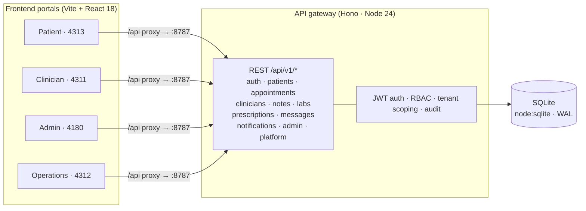

# PulseWard HMS

PulseWard is a multi-tenant hospital management system: one API gateway backing four
role-specific web portals for patients, clinicians, operations, and administrators.

- **Backend** — a single [Hono](https://hono.dev) API gateway on Node 24, with SQLite
  (the built-in `node:sqlite`, WAL mode) for storage. All 41 REST routes, authentication,
  multi-tenancy, auditing, and notifications live in this one process.
- **Frontend** — four Vite + React 18 single-page apps, one per role.
- **Auth** — JWT (HS256 via `jose`), short-lived access tokens with single-use rotating
  refresh tokens, bcrypt-hashed passwords.
- **Multi-tenancy** — every record carries a `tenant_id`; a tenant is one hospital or org.

## Architecture



In production, an nginx reverse proxy ([`nginx/nginx.conf`](nginx/nginx.conf)) serves the
four built SPAs and forwards `/api/*` to the gateway. See [`docker-compose.yml`](docker-compose.yml).

## Repository Layout

```
pulseward-hms/
├── apps/
│   ├── admin-console/          # Admin portal        (React + Vite, :4180)
│   ├── clinician-portal/       # Clinician workspace (React + Vite, :4311)
│   ├── operations-dashboard/   # Ops dashboard       (React + Vite, :4312)
│   ├── patient-portal/         # Patient portal      (React + Vite, :4313)
│   └── landing-page/           # Static marketing site
├── services/
│   └── api-gateway/            # The single Hono backend (all routes, auth, DB)
├── docs/site/                  # VitePress documentation site
├── tests/                      # Jest integration + contract tests
├── scripts/                    # Release pipeline and quality-gate tooling
├── nginx/                      # Production reverse-proxy config
└── docker-compose.yml          # Production stack: gateway + nginx + SPAs
```

## Quickstart

**Prerequisites:** Node.js 24+ and Corepack-enabled pnpm 9.15.0.

```powershell
corepack enable
corepack prepare pnpm@9.15.0 --activate
pnpm install --frozen-lockfile
```

Generate a signing secret and write your local env file:

```powershell
pnpm run jwt:generate     # prints a 256-bit JWT_SECRET
cp .env.example .env      # then paste the secret into .env
```

Start the API gateway plus all four portals with hot reload:

```powershell
pnpm run dev
```

To run only the API gateway (production mode, no HMR):

```powershell
pnpm run start
```

### Ports

| Surface              | URL                   |
| -------------------- | --------------------- |
| API gateway          | http://localhost:8787 |
| Patient portal       | http://localhost:4313 |
| Clinician portal     | http://localhost:4311 |
| Operations dashboard | http://localhost:4312 |
| Admin console        | http://localhost:4180 |

### Demo accounts (seeded on first boot)

| Role      | Email                     | Password      |
| --------- | ------------------------- | ------------- |
| Admin     | `admin@pulseward.com`     | `Admin@123`   |
| Clinician | `dr.sharma@pulseward.com` | `Doctor@123`  |
| Clinician | `dr.mehta@pulseward.com`  | `Doctor@123`  |
| Patient   | `patient@pulseward.com`   | `Patient@123` |

## Authentication

JWT via `jose` (HS256), signed with `JWT_SECRET`.

- **Access token** — 15 minutes, carries `{ sub, role, tid, eid }`.
- **Refresh token** — 30 days, single-use and rotated on every refresh, stored in the
  `refresh_tokens` table. Each portal's `api.js` silently refreshes on a 401 and retries.
- **Passwords** — bcrypt (cost 10) via `bcryptjs`.

Roles are `admin`, `clinician`, `patient`, `frontdesk`, and `ops`; `requireRole(...)`
guards each route.

## Quality Gates

```powershell
pnpm run verify          # lint + format:check + test:quick + contracts:check (strict)
```

Individual gates:

```powershell
pnpm run lint            # ESLint
pnpm run format:check    # Prettier (read-only)
pnpm test                # Jest with coverage
pnpm run test:quick      # Jest without coverage
pnpm run contracts:check -- --strict   # OpenAPI ↔ runtime route parity
pnpm run build:types     # TypeScript type-check (no emit)
```

The contract check asserts that every route in
[`services/api-gateway/openapi.yaml`](services/api-gateway/openapi.yaml) has a live handler
and vice versa — currently 41/41 in full parity.

## Testing

Jest runs the ESM integration suite in `tests/` (config: `jest.config.cjs`). A single file:

```powershell
node --experimental-vm-modules node_modules/jest/bin/jest.js --config jest.config.cjs tests/api/rbac-access.test.mjs
```

## Deployment

The production stack builds each portal to static assets and serves them through nginx,
which reverse-proxies `/api/*` to the gateway container:

```powershell
pnpm run build            # build all four portals to apps/*/dist
docker compose up -d      # gateway + nginx + static SPAs
```

Release automation lives in [`scripts/release.mjs`](scripts/release.mjs)
(`pnpm run release -- --version X.Y.Z`): quality gate → version bump → changelog → build →
artifacts → Docker → checksums → tag → push.

## Documentation

Full documentation is the VitePress site under [`docs/site/`](docs/site/):

- [API reference](docs/site/api.md)
- [Architecture](docs/site/architecture/index.md) — [auth flow](docs/site/architecture/auth-flow.md), [data model](docs/site/architecture/data-model.md), [service map](docs/site/architecture/service-map.md), [deployment](docs/site/architecture/deployment.md)
- [Local development](docs/site/local-dev.md)
- [Multi-tenancy](docs/site/multi-tenancy.md)
- [Environment variables](docs/site/env-vars.md)

Build and preview the docs locally:

```powershell
pnpm run build:docs
```

## Tech Stack

| Layer    | Technology                              |
| -------- | --------------------------------------- |
| Runtime  | Node.js 24                              |
| API      | Hono, `jose` (JWT), `bcryptjs`, `zod`   |
| Database | SQLite via built-in `node:sqlite` (WAL) |
| Frontend | React 18, Vite                          |
| Tooling  | pnpm workspaces, Jest, ESLint, Prettier |
| Ops      | Docker Compose, nginx, VitePress        |

## License

Proprietary and confidential. See [LICENSE.md](LICENSE.md).
