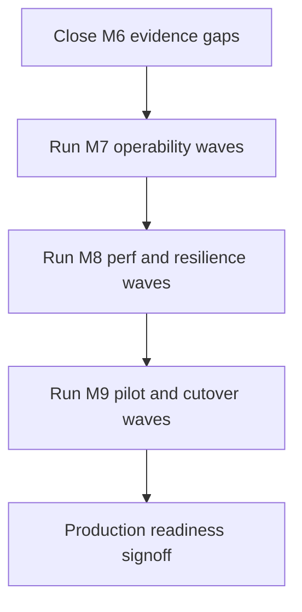
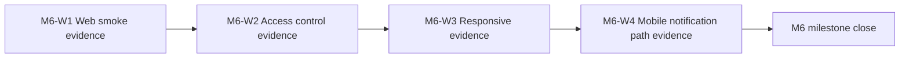

# Temporary M6-M9 Execution Instructions

This temporary guide is the fastest path to close M6 and execute M7 to M9 in grouped waves with clear evidence.

## What Is Automated Now

- Roadmap top snapshot can be refreshed automatically from the ledger using:

```powershell
npm run roadmap:refresh
```

- The snapshot includes exact M6 to M9 remaining grouped waves, evidence status, and a milestone flow chart.

## Current Accurate Remaining Waves

- M6 closeout: 0 waves remaining (closed)
- M7: 0 waves remaining
- M8: 0 waves remaining
- M9: 0 waves remaining
- Total remaining: 0 waves

## Detailed Milestones Update Rule

For every execution slice, apply this rule:

1. If the slice changes milestone goals, scope, exit criteria, sequencing, or assumptions, update the section ## Detailed Milestones in docs/ROADMAP-TODO.md in the same slice.
2. Add a short explanation note in the same update describing what changed and why.
3. Run npm run roadmap:refresh after the change.
4. If no milestone definition changed, explicitly note that no Detailed Milestones update was required for that slice.

## Execution Evidence Captured This Run

- npm run test:smoke: passed
- npm run contracts:check -- --strict: passed
- npm run build:apps: passed (all four portals built successfully)

This evidence is recorded in the roadmap as M6 closeout wave 1.

Additional evidence captured:

- npm run test:quick -- tests/auth/auth-policy-enforcement.test.js tests/auth/admin-settings-auth-policy.test.js tests/billing/billing-clinical-trigger-hooks.test.js: passed (3 suites, 16 tests)
- npm run test:responsive: passed (all four portals validated for viewport meta and max-width media-query baseline)
- npm run test:quick -- tests/notification/appointment-event-ingestion-validation.test.js: passed (1 suite, 2 tests)
- npm run ops:observability:check: passed (4 alert rules and 5 runbooks validated)
- npm run runbook:backup-drill -- --tenant citycare-hospital --backup-id backup-2026-04-04 --restore-target sandbox-citycare --rto-minutes 45 --rpo-minutes 15 --operator platform-operations: passed (backup drill evidence artifact generated)
- npm run ops:oncall:check: passed (3 escalation levels and 9 service ownership mappings validated)
- npm run runbook:restore-verify -- --tenant citycare-hospital --records-file docs/runbooks/evidence/restore-validation-sample-citycare-2026-04-04.json --operator platform-operations: passed (tenant isolation restore evidence generated)
- npm run ops:trace:check: passed (structured logging and correlation baseline validated across 9 service runtimes)
- npm run ops:incident:check: passed (incident readiness baseline validated with 4 severities and 6 required runbook sections)
- npm run ops:m7:check: passed (aggregate M7 operability gate validated 4 nested checks plus backup/restore evidence artifacts)
- npm run perf:m8:check: passed (M8 load baseline validated with 5 required profiles and 7 required runbook sections)
- npm run perf:m8:resilience:check: passed (M8 resilience baseline validated with 3 required drills and 6 required runbook sections)
- npm run perf:m8:rc:evidence:check: passed (M8 RC evidence-presence gate validated latest dated artifact and required nested-check anchors)
- npm run perf:m8:rc:check: passed (M8 release-candidate gate validated 7 nested checks across evidence presence, contracts, route loading, adapter regressions, and portal builds)
- npm run runbook:m8:rc:evidence -- --environment staging --operator platform-operations: passed (dated RC gate evidence artifact generated under docs/runbooks/evidence)
- npm run perf:m8:final:check: passed (M8 milestone-closeout gate validated load baseline, resilience baseline, RC evidence-presence, RC regression gate, and evidence artifact pass markers)
- npm run pilot:m9:check: passed (M9 pilot and cutover baseline validated cohort scope, acceptance criteria thresholds, required cutover checklist items, and hypercare controls)
- npm run runbook:m9:pilot:evidence -- --environment staging --tenant citycare-hospital --operator platform-operations: passed (dated M9 pilot/cutover evidence artifact generated under docs/runbooks/evidence)
- npm run pilot:m9:evidence:check: passed (M9 pilot evidence-presence gate validated latest dated artifact and required coverage anchors)
- npm run runbook:m9:rehearsal:evidence -- --date=2026-04-04 --environment=staging: passed (dated M9 cutover rehearsal evidence artifact generated under docs/runbooks/evidence)
- npm run pilot:m9:rehearsal:evidence:check: passed (M9 rehearsal evidence-presence gate validated strict rehearsal status and coverage anchors)
- npm run pilot:m9:rehearsal:check: passed (M9 rehearsal readiness gate validated pilot dependency, rehearsal controls, and strict evidence coverage)
- npm run runbook:m9:golive:evidence -- --date=2026-04-04 --environment=staging: passed (dated M9 go-live acceptance evidence artifact generated under docs/runbooks/evidence)
- npm run pilot:m9:golive:evidence:check: passed (M9 go-live evidence-presence gate validated strict acceptance and guardrail anchors)
- npm run pilot:m9:golive:check: passed (M9 go-live readiness gate validated pilot/rehearsal dependencies, acceptance controls, and strict evidence coverage)
- npm run pilot:m9:final:check: passed (M9 production-readiness closeout gate validated all nested evidence/readiness checks and latest pass-marker coverage across pilot, rehearsal, and go-live artifacts)

This evidence is recorded in the roadmap as M6 closeout waves 2, 3, and 4, with M6 closeout now complete.

## Delivery Flow



## M6 Closeout Plan (Immediate)



### M6-W1: Web Smoke Evidence

1. Start required services and portals.
2. Run smoke checks:

```powershell
npm run test:smoke
npm run contracts:check -- --strict
npm run build:apps
```

3. Capture evidence in docs with timestamp and result summary.

### M6-W2: Access Control Evidence

1. Validate tenant role boundaries across admin, clinician, patient, and operations surfaces.
2. Record route-level access matrix and pass/fail results.

### M6-W3: Responsive Evidence

1. Capture desktop/tablet/mobile screenshots for priority pages in each portal.
2. Record viewport matrix and critical interaction results.

### M6-W4: Mobile Notification Path Evidence

1. Create or finalize Expo mobile app track under apps/mobile-notifications.
2. Validate tenant-scoped notification fetch and render flow.
3. Record auth/session and notification evidence in docs.

## M7, M8, M9 Wave Template

For each wave:

1. Implement one end-to-end vertical slice.
2. Add tests and run validations.
3. Update docs and run:

```powershell
npm run roadmap:refresh
```

4. Commit, push, and observe CI.

## Exact Evidence Record Template

Use this checklist per wave:

- Scope completed
- Validation commands and outcomes
- Contract and API compatibility impact
- Rollback note
- Risks and follow-up

## Commands You Can Run After Every Slice

```powershell
npm run roadmap:refresh
npm run test:quick
npm run contracts:check -- --strict
```

## If You Want Me To Continue The Next Wave Immediately

Provide the next wave target in this format:

- Milestone: M6 or M7 or M8 or M9
- Wave: for example M6-W1
- Definition of done
- Any environment constraints

I will execute the wave, update docs, refresh roadmap snapshot, and return evidence plus next wave.
