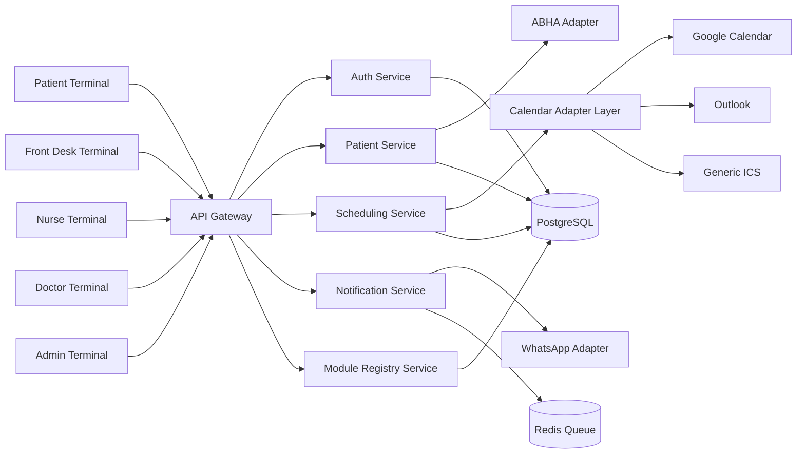
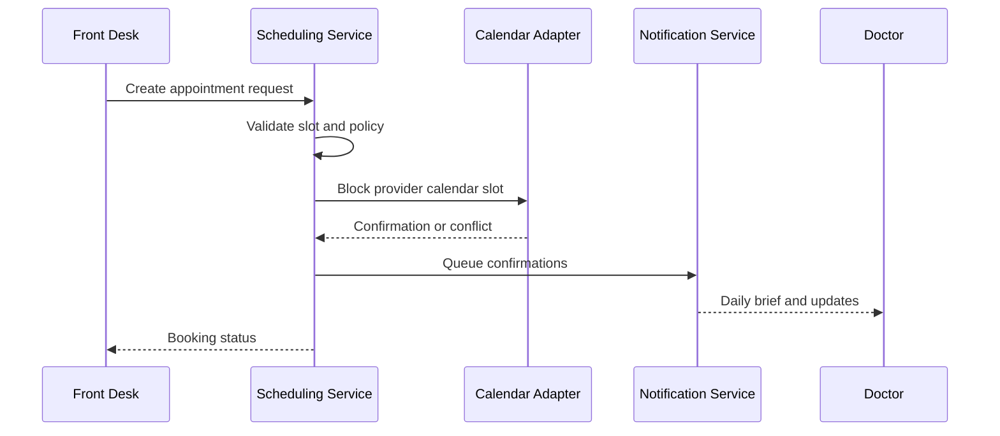
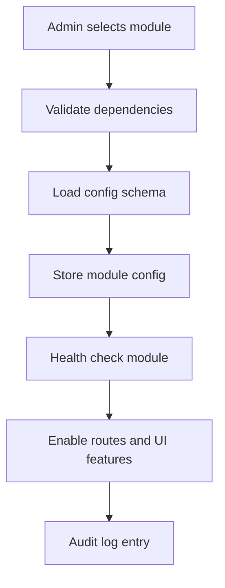

# PulseWard HMS Foundation Handoff

## Is This Required?

No. Chat continuity does not strictly require this file.

## Why This File Exists

This file is the single source of truth for the initial architecture direction so future conversations can continue quickly and consistently from inside the project.

## Product Identity

- Product name: PulseWard HMS
- Brand idea: Calm, reliable, patient-first operating system for hospitals
- Positioning: Simple to run, modular to grow, affordable to operate

## Core Product Goals

- Keep first release operationally simple and low-cost
- Support small clinic to large hospital scale without rewrite
- Allow admin-led module enable or disable without code changes
- Standardize internal APIs and contracts early
- Design iteration-first delivery model for predictable expansion

## Primary User Surfaces

- Patient terminal
- Front desk terminal
- Nurse terminal
- Doctor terminal
- Admin terminal

## Architecture Principles

1. Modular by default
2. Config-first behavior
3. Contract-first APIs
4. Event-driven where useful
5. Least-cost deploy path first
6. Replaceable integrations via adapters

## Recommended Practical Tech Stack (Low Overhead)

### Frontend

- Next.js (App Router) for portals and landing pages
- Tailwind CSS + component library in shared package
- Server-side rendering for SEO pages

### Backend

- Python FastAPI for core services (strong fit for scheduling logic + AI-assisted workflows)
- Node.js service adapters only where SDK ecosystem is better (optional)
- PostgreSQL as primary database
- Redis for queues, caching, and schedule locks

### Messaging and Jobs

- Celery or RQ (Python) for scheduled jobs and async notifications
- Redis as broker to avoid extra infra at start

### Infra and Deployment

- Docker Compose for first production rollout
- Optional upgrade to Kubernetes later
- Caddy or Nginx reverse proxy
- GitHub Actions for CI/CD

### Observability

- Loki + Promtail + Grafana (cost-aware logging/metrics)
- Sentry free tier for app error tracking

## Multi-Tenant and Scale Strategy

- Start single-tenant deployment per hospital group
- Add tenant_id boundaries in data model from day one
- Service boundaries stable; horizontal scale only when needed
- Read replicas and queue workers as first scaling lever

## Configurability Model

- Global config: system-level defaults
- Site config: hospital-level overrides
- Module config: per-module toggles and policy values
- Provider config: integration credentials and mapping

## Module Registry Pattern

All optional capabilities must be represented in a module registry table and loaded by config.

Required module metadata:

- module_key
- display_name
- enabled
- depends_on
- config_schema
- provider_type
- version

## Appointment and Scheduling Design

### Core scheduling capabilities

- Doctor availability templates
- Slot generation rules
- Buffer and break handling
- Overbooking policy
- Conflict prevention
- Waitlist auto-fill

### Scheduling policy controls

- Slot size by specialty
- Max daily appointments per doctor
- Emergency insertion rules
- Follow-up priority windows
- No-show penalty logic

## Calendar Integration Architecture

Use adapter interface so provider changes never affect core scheduling domain.

Adapter targets:

- Google Calendar
- Apple Calendar via CalDAV where feasible
- Outlook Calendar
- Generic ICS feed export and import

Unified operations:

- create_event
- update_event
- cancel_event
- fetch_busy_slots
- push_daily_agenda

## WhatsApp Daily Brief Strategy

### Recommended rollout path

1. Start with free or low-cost channel fallback:

- Email daily digest
- In-app dashboard digest

2. Add WhatsApp Business API when needed:

- Use provider adapter for Twilio, Meta Cloud API, or local BSP
- Keep notification templates configurable

3. Daily brief content

- Total appointments
- First patient ETA
- Follow-up list
- Pending critical tasks
- Cancellations and reschedules

## ABHA (India) Patient Profiling

- ABHA integration must be isolated in dedicated adapter service
- Store only required identifiers and consent-linked references
- Keep audit log for every ABHA lookup or write
- Respect consent and revocation workflow by design

## Internal API Contract Rules

- Every service must publish OpenAPI spec
- Shared error model across all services
- Idempotency keys for booking and payment endpoints
- Backward-compatible versioning policy
- Consumer contract tests in CI before merge

## API Versioning Policy (Initial)

- URI versioning for public APIs: /api/v1
- Internal service version via headers and schema registry
- Deprecation window with clear sunset dates

## Security Baseline

- RBAC + optional attribute-based constraints
- JWT access tokens with short TTL
- Encrypted secrets management
- PII data classification and masking in logs
- Full audit trail for clinical and scheduling operations

## Iterative Delivery Model

### Iteration 0: Foundation

- Auth
- RBAC
- Core patient profile
- Core doctor profile
- Basic scheduling engine
- Admin module registry

### Iteration 1: Operational Core

- Front desk workflows
- Nurse workflows
- Doctor calendar sync
- Notification center

### Iteration 2: External Integrations

- ABHA adapter
- WhatsApp provider adapter
- Generic ICS interoperability

### Iteration 3: Optimization

- Predictive no-show scoring
- Capacity analytics
- AI assistant for operational recommendations

## AI Project Agent Constitution and Prompt Files

Use these files as mandatory references for any AI automation in the project.

- governance/ai-agent-constitution.md
- governance/ai-prompts/system.prompt.md
- governance/ai-prompts/planner.prompt.md
- governance/ai-prompts/reviewer.prompt.md

## Visual Aid 1: System Container Diagram

## Visual Aid 2: Appointment Lifecycle

## Visual Aid 3: Module Enablement Flow

## Immediate Next Build Steps

1. Create canonical OpenAPI skeleton for auth, patient, scheduling, notification services.
2. Define shared error schema and idempotency strategy.
3. Implement module registry service and admin toggle UI.
4. Build scheduling MVP with ICS export first, provider adapters next.
5. Add AI prompt files and enforce constitution reference in CI checks.

## Decision Log Rules

- Every architecture change must include reason, alternatives, and rollback plan.
- No direct provider coupling in domain services.
- No hidden environment dependency without config schema.
