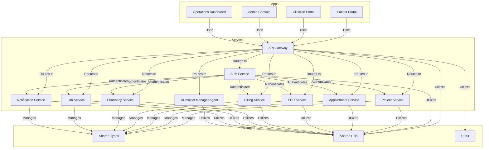

# PulseWard Hospital Management System - Container Diagram

## Overview

The PulseWard Hospital Management System (HMS) is designed to streamline healthcare management by integrating various applications and services into a cohesive system. This document outlines the container architecture of the PulseWard HMS, detailing the interactions between different components and their responsibilities.

## Container Diagram

## Component Descriptions

### Applications

- **Patient Portal**: Allows patients to access their health information, manage appointments, and communicate with healthcare providers.
- **Clinician Portal**: Enables clinicians to manage patient care, view records, and collaborate with other healthcare professionals.
- **Admin Console**: Used for administrative tasks, user management, and system configuration.
- **Operations Dashboard**: Provides insights into hospital operations, performance metrics, and resource management.

### Services

- **API Gateway**: Acts as a single entry point for all client requests, routing them to the appropriate services.
- **Auth Service**: Manages user authentication and authorization across the system.
- **Patient Service**: Handles patient records, including personal information and medical history.
- **Appointment Service**: Manages patient appointments, scheduling, and notifications.
- **EHR Service**: Manages electronic health records, ensuring secure access and updates.
- **Billing Service**: Handles patient billing, payments, and insurance claims.
- **Pharmacy Service**: Manages medication prescriptions, inventory, and patient medication history.
- **Lab Service**: Manages lab tests, results, and reporting.
- **Notification Service**: Sends notifications to patients and staff regarding appointments, test results, and other important updates.
- **AI Project Manager Agent**: Assists in project management tasks, ensuring efficient workflow and task allocation.

### Packages

- **Shared Types**: Contains shared TypeScript types used across the applications and services.
- **Shared Utils**: Provides utility functions that can be reused across different components.
- **UI Kit**: Contains reusable UI components for consistent design across applications.

## Conclusion

The container architecture of the PulseWard HMS is designed to ensure modularity, scalability, and maintainability. Each component is responsible for specific functionalities, allowing for efficient development and deployment. The integration of an AI project manager agent enhances project management capabilities, ensuring smooth collaboration and task execution throughout the development lifecycle.
