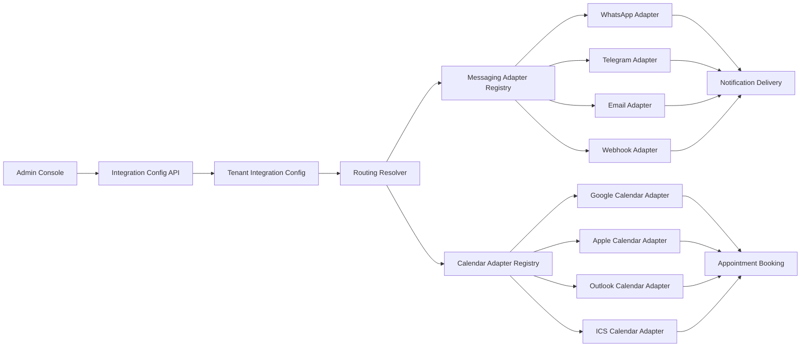

# Provider Adapter Model for Messaging and Calendars

## Purpose

Enable plug-and-play integration providers so each hospital tenant can choose WhatsApp, Telegram, Email, Webhook, Google Calendar, Apple Calendar, Outlook, or ICS without changing core business logic.

## Architecture Pattern

- Core domain services call provider-agnostic interfaces.
- Provider adapters implement the interfaces.
- Tenant config selects default and fallback providers.
- Admin can update provider selection through configuration APIs.

## Messaging Channels Covered

- patient-notification
- staff-notification
- website-hook

## Diagram

## Extension Rules

1. Add provider key to shared types.
2. Add provider config shape in schema.
3. Implement adapter class in service adapter folder.
4. Register provider in adapter registry.
5. Add provider test endpoint behavior.
6. Update admin documentation.
