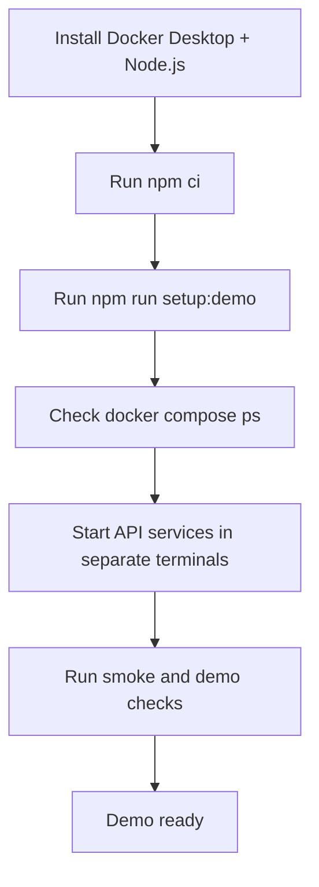

# Demo Quickstart (Docker Desktop First)

This guide is designed for first-time setup with the least manual work.

## Setup Flow



## Prerequisites

- Docker Desktop running with Linux containers
- Node.js 22+
- npm 10+

## Step 1: Install Dependencies

From repository root:

```powershell
npm ci
```

## Step 2: One-Command Local Setup

Run:

```powershell
npm run setup:demo
```

What this does:

- Validates Docker engine and Docker Compose availability
- Installs app dependencies
- Creates .env from .env.example if needed
- Runs docker compose up with build
- Prints service status

## Step 3: Verify Compose Services

```powershell
docker compose ps
```

Expected status: all configured services show State as running/healthy.

## Step 4: Start Local API Services

Use separate terminals:

```powershell
npm run start:auth
```

```powershell
npm run start:notification
```

```powershell
npm run start:appointment
```

## Step 5: Start Web Surfaces (Optional For Full Demo)

```powershell
npm run start:landing
```

```powershell
npm run start:operations:dev
```

```powershell
npm run start:admin:dev
```

## Step 6: Run Demo And Health Checks

```powershell
npm run demo:opd
```

```powershell
npm run test:smoke
```

```powershell
npm run contracts:check -- --strict
```

## Service Port Map

| Service                  | URL                   |
| ------------------------ | --------------------- |
| API Gateway              | http://localhost:8080 |
| Auth Service             | http://localhost:8081 |
| Patient Service          | http://localhost:8082 |
| Appointment Service      | http://localhost:8083 |
| EHR Service              | http://localhost:8084 |
| Billing Service          | http://localhost:8085 |
| Pharmacy Service         | http://localhost:8086 |
| Lab Service              | http://localhost:8087 |
| Notification Service     | http://localhost:8088 |
| AI Project Manager Agent | http://localhost:8089 |

## Stop Everything

```powershell
npm run demo:down
```

## If Something Fails

1. Restart Docker Desktop and wait until engine is fully ready.
2. Re-run setup:

```powershell
npm run setup:demo
```

3. Inspect logs:

```powershell
docker compose logs --tail=120
```

## Next Guide

For domain migration and production-like rollout:

- docs/deployment/deploy-and-domain-migration.md
