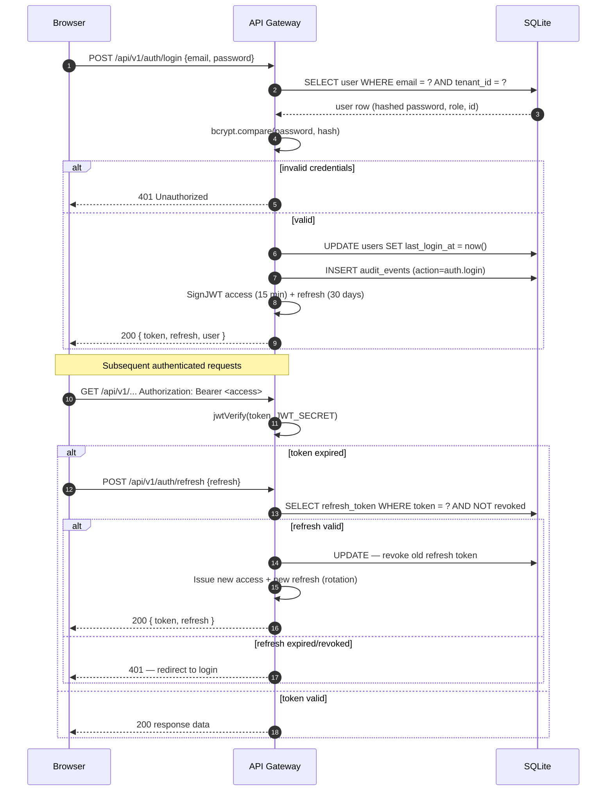

# Auth Flow

JWT-based authentication with rotating refresh tokens and full audit trail.

| Element                 | Description                                                                                   |
| ----------------------- | --------------------------------------------------------------------------------------------- |
| **Browser**             | Any of the 4 React portals storing `token` + `refresh` in localStorage                        |
| **API Gateway**         | Hono on Node 24; handles all auth endpoints at `/api/v1/auth/*`                               |
| **SQLite**              | Stores users with bcrypt hashes, refresh tokens (UNIQUE constraint), and audit log            |
| **bcrypt.compare**      | Cost-10 bcrypt via `bcryptjs`; no SHA-256                                                     |
| **SignJWT / jwtVerify** | `jose` library; HS256 algorithm; `JWT_SECRET` env var                                         |
| **Access token**        | 15-minute expiry; carries `sub` (user ID), `role`, `tid` (tenant ID), `eid` (entity ID)       |
| **Refresh token**       | 30-day expiry; single-use (rotated on each use); revoked on explicit logout                   |
| **Audit log**           | Every auth event (login, logout, refresh, failed attempt) written to the `audit_events` table |
| **Token rotation**      | Old refresh token is invalidated on each refresh — leaked tokens self-expire                  |
