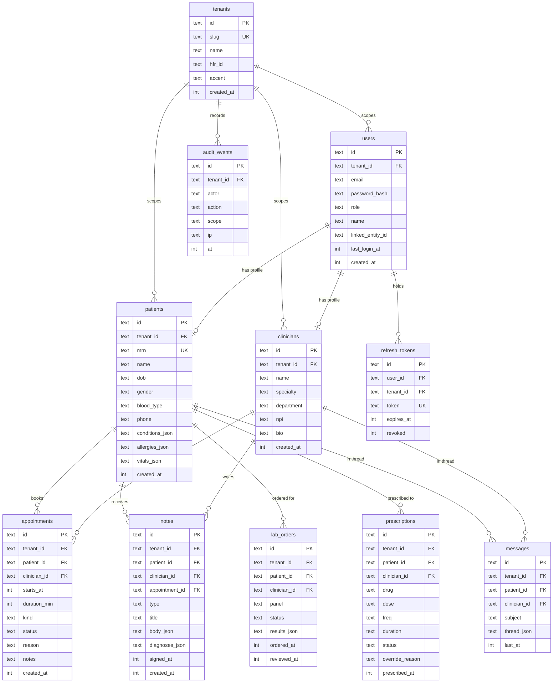

# Data Model

SQLite schema with row-level multi-tenant isolation.

| Table              | Purpose                                                  | Key Constraints                                                                                                                     |
| ------------------ | -------------------------------------------------------- | ----------------------------------------------------------------------------------------------------------------------------------- |
| **tenants**        | Hospital registry; one row per hospital in the shared DB | `slug` UNIQUE — stable tenant key; requests are scoped at runtime by the JWT `tid` claim, not the slug                              |
| **users**          | Authentication subjects for all roles                    | `(tenant_id, email)` UNIQUE; `password_hash` is bcrypt cost-10; `linked_entity_id` → patient or clinician id                        |
| **patients**       | Clinical demographic record                              | `(tenant_id, mrn)` UNIQUE; MRN assigned atomically in `db.transaction()`; JSON columns for conditions, allergies, vitals            |
| **clinicians**     | Provider profile                                         | `npi` (provider identifier); not linked to a users row directly — join via `users.linked_entity_id`                                 |
| **appointments**   | Scheduled encounters                                     | `status` ∈ `{scheduled, checked-in, in-progress, completed, cancelled, no-show}`; indexed on `(tenant_id, clinician_id, starts_at)` |
| **notes**          | Clinical documentation (SOAP, progress, discharge, etc.) | `signed_at` non-null = locked; `body_json` stores subjective/objective/assessment/plan; `diagnoses_json` stores ICD-10 codes        |
| **lab_orders**     | Lab panel orders and results                             | `results_json` stores keyed result values; `status` ∈ `{ordered, in-lab, resulted, reviewed, cancelled}`                            |
| **prescriptions**  | Medication orders                                        | `status` ∈ `{active, dispensed, completed, discontinued}`; `override_reason` for allergy override                                   |
| **messages**       | Bidirectional secure messaging                           | One row per patient-clinician thread; `thread_json` stores the full message array                                                   |
| **refresh_tokens** | JWT refresh token store                                  | `token` UNIQUE; `revoked=1` immediately after use (single-use rotation)                                                             |
| **audit_events**   | Immutable event log                                      | Append-only; indexed on `(tenant_id, at DESC)`                                                                                      |
