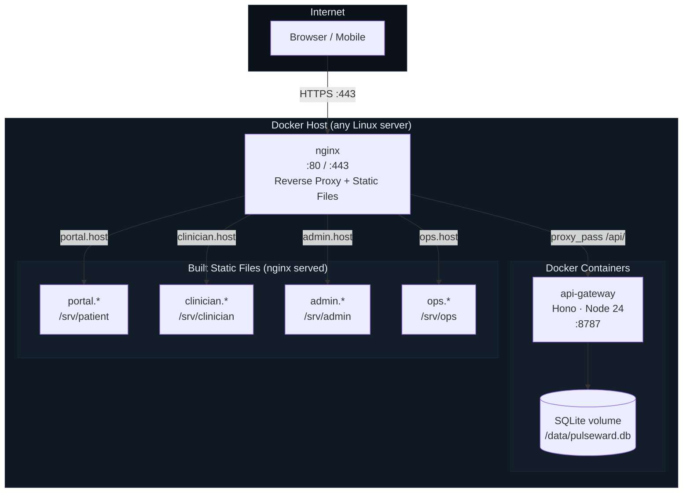

# Deployment Topology

How PulseWard HMS is laid out on a single-host Docker deployment.

| Element              | Description                                                                                                                                                                        |
| -------------------- | ---------------------------------------------------------------------------------------------------------------------------------------------------------------------------------- |
| **Browser / Mobile** | End-users on any device; TLS required in production                                                                                                                                |
| **nginx**            | Handles TLS termination (Let's Encrypt / custom cert), serves built React dist files, proxies `/api/*` to the gateway container; one `server` block per portal, routed by hostname |
| **api-gateway**      | The only running Node process; listens on :8787; not exposed directly to the internet                                                                                              |
| **SQLite volume**    | Named Docker volume `pulseward-data` mounted at `/data` (`DB_PATH=/data/pulseward.db`); WAL mode enabled; daily backup recommended to object storage (R2/S3)                       |
| **Patient Portal**   | Built to `apps/patient-portal/dist`; mounted at `/srv/patient`; served on `portal.yourhospital.com`                                                                                |
| **Clinician Portal** | Built to `apps/clinician-portal/dist`; mounted at `/srv/clinician`; served on `clinician.yourhospital.com`                                                                         |
| **Admin Console**    | Built to `apps/admin-console/dist`; mounted at `/srv/admin`; served on `admin.yourhospital.com`                                                                                    |
| **Ops Dashboard**    | Built to `apps/operations-dashboard/dist`; mounted at `/srv/ops`; served on `ops.yourhospital.com`                                                                                 |

### Production Checklist

- Build the four portals first: `docker compose --profile build run --rm frontend-builder`
- Set `JWT_SECRET` to a random 256-bit value (run `node scripts/generate-jwt-secret.mjs`)
- Enable HTTPS: drop your certificate and key into `nginx/ssl/` and point `server_name` at your domains
- Set `CORS_ALLOWED_ORIGINS` to your production portal origins only
- Keep the `pulseward-data` volume on persistent storage
- Set up automated daily backups of the SQLite file
