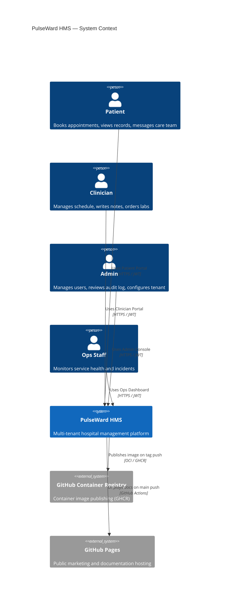

# System Context

High-level view of every actor and system boundary in PulseWard HMS.

| Element                       | Type     | Description                                                                      |
| ----------------------------- | -------- | -------------------------------------------------------------------------------- |
| **Patient**                   | Person   | Registered user who books appointments, reads lab results, and sends messages    |
| **Clinician**                 | Person   | Doctor/nurse who manages their schedule, writes SOAP notes, and prescribes       |
| **Admin**                     | Person   | Hospital IT/management who creates users, assigns roles, and reads the audit log |
| **Ops Staff**                 | Person   | Signs in with an `admin` or `ops` account to monitor health and incidents        |
| **PulseWard HMS**             | System   | The platform itself — API gateway + 4 React portals + SQLite                     |
| **GitHub Container Registry** | External | GHCR (`ghcr.io/life-experimentalist/pulseward-hms`) for versioned image releases |
| **GitHub Pages**              | External | Hosts the marketing landing page and this VitePress docs site                    |

Notifications are delivered **in-app only** — there is no external email, SMS, or push
channel. Beyond the two CI/CD integrations above, the platform has no third-party runtime
dependencies. A fifth role, `frontdesk`, shares the clinical portals for patient
registration and scheduling.
