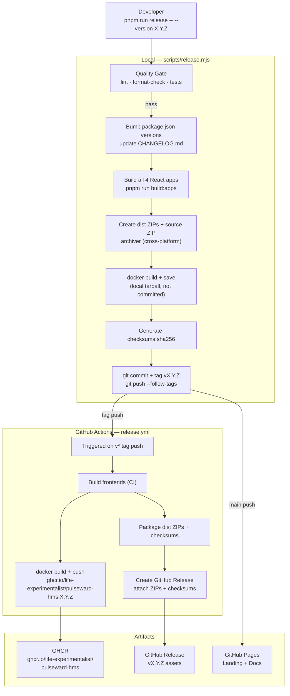

# Release Pipeline

How code flows from a version tag to deployed artifacts.

| Step                 | Tool                          | Description                                                                                                               |
| -------------------- | ----------------------------- | ------------------------------------------------------------------------------------------------------------------------- |
| **Quality Gate**     | `scripts/release.mjs`         | Runs `pnpm lint`, `pnpm format:check`, `pnpm test:quick` — blocks on any failure                                          |
| **Version bump**     | `release.mjs`                 | Sets `version` in the root and all four app `package.json` files (JSON rewrite)                                           |
| **Changelog update** | `release.mjs`                 | Inserts a new `## [vX.Y.Z]` section dated today, sourced from `docs/releases/vX.Y.Z.md` or the git log since the last tag |
| **Build apps**       | `pnpm run build:apps`         | Vite production build for all 4 React portals                                                                             |
| **Dist ZIPs**        | `archiver` npm package        | `releases/vX.Y.Z/{patient-portal,clinician-portal,admin-console,ops-dashboard}.zip` + `pulseward-hms-vX.Y.Z-src.zip`      |
| **Docker local**     | `docker build + save`         | Creates a local `.tar` for testing — not committed (too large for git)                                                    |
| **Checksums**        | `sha256`                      | `releases/vX.Y.Z/checksums.sha256` — committed to git                                                                     |
| **Git tag**          | `git tag -a vX.Y.Z`           | Annotated tag with release message; triggers the CI pipeline on push                                                      |
| **GHCR push**        | `docker/build-push-action`    | Multi-tag via `docker/metadata-action`: `X.Y.Z`, `X.Y`, `sha-<short>`, and `latest` on the default branch                 |
| **GitHub Release**   | `softprops/action-gh-release` | Attaches dist ZIPs, source ZIP, and checksums.sha256 as release assets                                                    |
| **GitHub Pages**     | `actions/deploy-pages`        | Triggered on `main` push; builds VitePress and deploys landing + docs                                                     |
