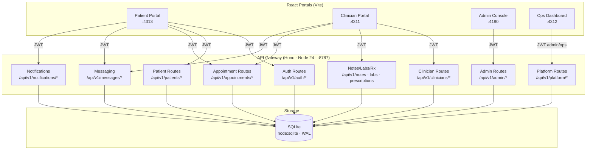

# Service Map

How the frontend portals and the single API gateway interact. There is no service mesh —
one Hono app handles every route and talks to one SQLite database.

| Node                     | Description                                                                                                                              |
| ------------------------ | ---------------------------------------------------------------------------------------------------------------------------------------- |
| **Patient Portal**       | React + Vite SPA; token in `pw_token` (localStorage); uses patients, appointments, labs, prescriptions, messages, notifications          |
| **Clinician Portal**     | React + Vite SPA; reads patient charts, writes notes/labs/prescriptions; token in `pw_clin_token`                                        |
| **Admin Console**        | React + Vite SPA; manages users and clinicians, reads audit log and stats, shows live health; token in `pw_admin_token`                  |
| **Ops Dashboard**        | React + Vite SPA; signs in with an `admin`/`ops` account and polls `/platform/health` and `/platform/incidents`; token in `pw_ops_token` |
| **API Gateway**          | Single Hono app (Node 24); all routes in one file; CORS enforced per `CORS_ALLOWED_ORIGINS`                                              |
| **Auth Routes**          | Login, signup, refresh, logout, `me`; issues JWTs signed with `JWT_SECRET`                                                               |
| **Patient Routes**       | Patient profile CRUD + transactional MRN assignment                                                                                      |
| **Appointment Routes**   | Scheduling CRUD with status transitions                                                                                                  |
| **Clinician Routes**     | Provider listing and profile lookup                                                                                                      |
| **Notes/Labs/Rx Routes** | Clinical documentation; PATCH routes emit audit events                                                                                   |
| **Messaging Routes**     | Thread-scoped message store; one thread per patient–clinician subject                                                                    |
| **Notifications**        | In-app inbox stored in the `notifications` table; read/marked-read by the portals                                                        |
| **Admin Routes**         | User/clinician management, audit log, stats, tenant list                                                                                 |
| **Platform Routes**      | Component health and incident feed for the Ops Dashboard                                                                                 |
| **SQLite**               | One file, WAL mode; **all tenants share one database**, isolated by the `tenant_id` column                                               |
